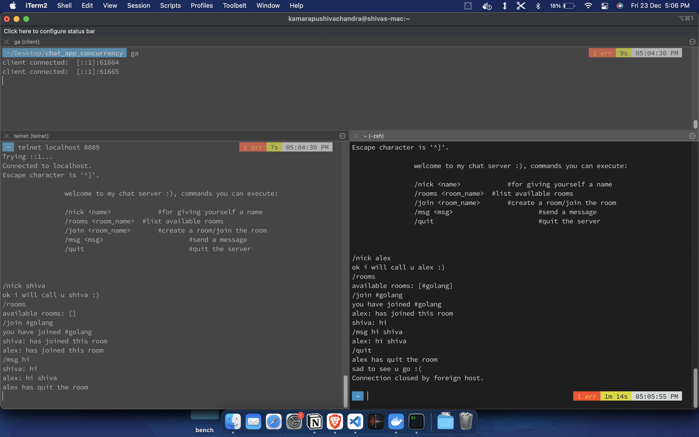

##  simple chat server using Golang

commands to try:
1.  /nick <name> 		#for giving yourself a name
2.  /rooms <room_name>  #list available rooms
3.  /join <room_name> 	#create a room/join the room
4.  /msg <msg> 			#send a message
5.  /quit   			#quit the server

